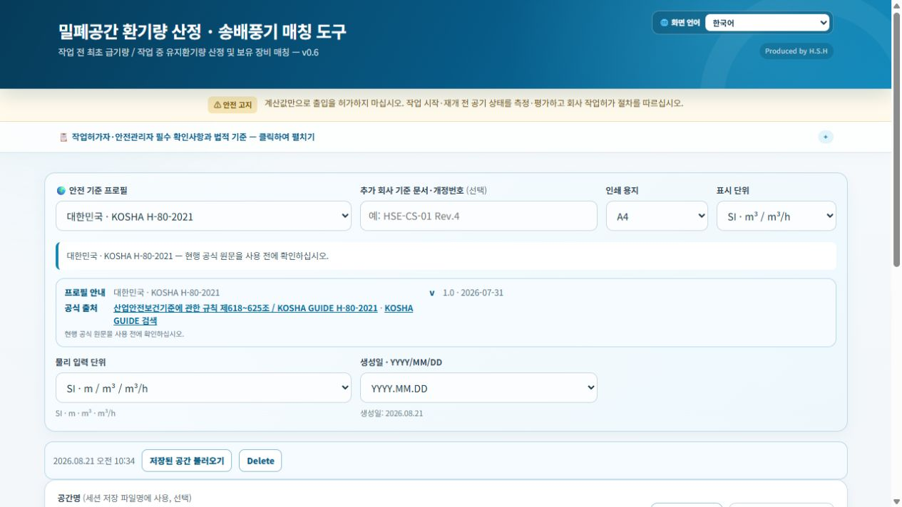

# 밀폐공간 환기량 산정 도구 / Confined Space Ventilation Calculator

Produced by H.S.H

밀폐공간의 최초 급기량·유지 환기량을 계산하고, 보유 송배풍기의 실질풍량과
필요 대수를 비교하는 오프라인 도구입니다.

An offline planning tool that calculates initial purge volume and continuous
ventilation airflow, then compares the requirement with available blowers.
It runs in a browser, Windows application, or Android application.

> 이 도구의 계산값은 설계·계획 참고용입니다. 실제 작업 전·중에는 관계 법령과
> 사업장 절차에 따라 산소 및 유해가스 농도를 현장에서 실측해야 합니다.

> **Safety note (English):** Calculations are for planning only. Before entry,
> re-entry, and during work, measure and evaluate oxygen and hazardous gases
> according to applicable law and the site work-permit procedure.

## 실제 화면 / See the calculator



작업 장소의 **안전 기준 프로필**을 먼저 선택한 뒤, 계산 방식·공간 체적·작업
조건을 입력하면 최초 급기량, 작업 중 유지 환기량, 그리고 보유 송배풍기의 필요
대수와 여유율을 한 화면 흐름으로 확인할 수 있습니다.

Select the workplace **safety jurisdiction profile**, then enter the method,
space volume, and work conditions. The calculator presents the initial purge,
continuous airflow, and the required blower quantity with reserve margin in
one workflow.

| 화면에서 하는 일 / What you do | 결과 / What you get |
| --- | --- |
| 안전 기준, 계산 방식, 공간·작업 조건 선택 / Choose profile, method, space, and conditions | 최초 급기량과 작업 중 유지 환기량 / Initial purge and continuous airflow |
| 보유 장비의 실질 풍량과 대수 입력 / Enter available blowers and actual airflow basis | 필요 대수·계획 대수·여유율 / Required quantity, planned quantity, and reserve margin |

## 빠른 사용 안내 / Quick user guide

- 공개 도구 / Live tool: <https://fullmetalsonic.github.io/confined-space-ventilation-calculator/>
- 한·영 통합 안내 / Bilingual illustrated guide: [docs/user-guide.html](docs/user-guide.html)
- 한국어 설명서 / Korean guide: [docs/user-guide-ko.html](docs/user-guide-ko.html)
- English user guide: [docs/user-guide-en.html](docs/user-guide-en.html)

## 가장 쉬운 실행 방법

최신 글로벌판은 `dist/html/밀폐공간_환기량_산정_도구_v0.6.html`입니다.
더블클릭하면 별도 설치 없이 PC·휴대기기 브라우저에서 오프라인으로 실행됩니다.

## Quick start (English)

Open `dist/html/밀폐공간_환기량_산정_도구_v0.6.html` in a desktop or mobile
browser. Select the calculation method, enter the space volume and work
conditions, review the required airflow, then compare available blowers. Use
the result report only as an attachment to—not a replacement for—the work
permit and atmospheric measurement record.

v0.6은 v0.5 기능을 유지하면서 CSS와 JavaScript를 기능별로 분리한 유지보수 구조
개선판입니다. 기존 v0.5 HTML·EXE·APK는 보존되며, 새 EXE·APK는 필요할 때만 v0.6
HTML을 지정해 다시 빌드합니다.

## 폴더 구조

## Project layout (English)

`src/` is the editable web source. The single-file HTML in `dist/html/` and
the embedded HTML in `app.py` are generated artifacts. See
[`docs/개발_구조_v0.6.md`](docs/개발_구조_v0.6.md) for the bilingual development
overview and [`docs/user-guide.html`](docs/user-guide.html) for the end-user
workflow with screenshots.

```text
.
├─ src/                              # v0.6 웹 소스(수정 기준)
│  ├─ index.html                     # 화면 마크업과 모듈 로드 순서
│  ├─ styles/                        # 기본 UI, v0.5 확장 스타일
│  └─ scripts/                       # 상태·계산·장비·보고서 등 기능별 코드
├─ dist/html/                        # 설치 없는 단일 HTML 배포본
│  └─ 밀폐공간_환기량_산정_도구_v0.6.html
├─ app.py                            # Windows pywebview 래퍼(생성 HTML 내장)
├─ android/                          # Android WebView 래퍼 원본
├─ assets/                           # 앱 아이콘
├─ docs/개발_구조_v0.6.md            # 모듈별 역할과 변경 절차
├─ scripts/
│  ├─ build_web.ps1                  # src를 단일 HTML로 번들
│  ├─ sync_desktop_html.ps1          # HTML을 app.py 내장본에 반영
│  ├─ verify_modular_web.ps1         # 모듈·번들·내장본 정적 검증
│  ├─ build_windows.ps1              # Windows EXE 빌드
│  └─ build_android.ps1              # Android APK 빌드
└─ 밀폐공간_환기량_산정_도구.html    # v0.3 역사적 기준 원본(수정 금지)
```

## 개발할 때 지킬 순서

수정은 `src/`에서만 합니다. `dist/html/...v0.6.html`과 `app.py`는 생성물이므로
직접 편집하지 않습니다.

```powershell
powershell -ExecutionPolicy Bypass -File .\scripts\build_web.ps1
powershell -ExecutionPolicy Bypass -File .\scripts\sync_desktop_html.ps1
powershell -ExecutionPolicy Bypass -File .\scripts\verify_modular_web.ps1
```

검증 통과 후에만, 필요 시 아래처럼 새 바이너리를 만듭니다.

```powershell
.\scripts\build_windows.ps1 -PythonExe "python.exe" -Version v0.6 -HtmlPath .\dist\html\밀폐공간_환기량_산정_도구_v0.6.html
.\scripts\build_android.ps1 -Version v0.6 -HtmlPath .\dist\html\밀폐공간_환기량_산정_도구_v0.6.html
```

상세한 모듈별 역할과 호환성 원칙은 `docs/개발_구조_v0.6.md`를 참고하세요.
